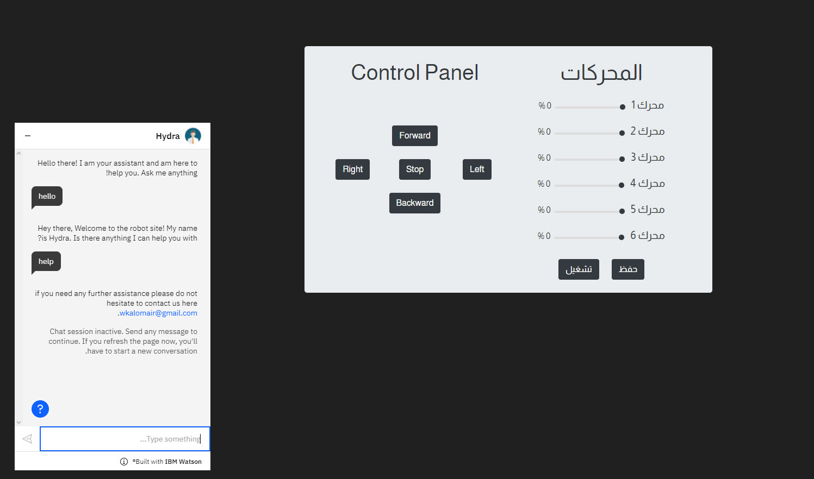

# ChatBot

## المقدمة:

##### في المهمة الثالثة من الاساليب الذكية طلبو مننا تصميم شات بوت ودمجه مع الموقع ويكون عنده مهارات وما الى ذلك.

## المهام المطلوبة:

<ul>
  <li>انشاء بوت متفاعل مع المستخدم.</li>
  <li>دمجه مع لوحه التحكم.</li>
  

</ul>

## طريقة إنشاء الشات بوت:
 
##### عن طريقه اتباع الشرح الموفر لنا قدرنا ننشئ البوت في الموقع حق اي بي ام واتسون ثم دمجته في صفحتي حقت الانجن والكنترول بانل لان كلهم بنفس الصفحة الاكواد وطريقتها موجوده في الاندكس اخر شي تحت طبعاً انشئنا له سكلز وانتقريشن بحيث يتواصل وسميته هايدرا 

## الشات بوت هايدرا:

#### صورة توضيحية للبوت والانتقريشن.

  
  
  
